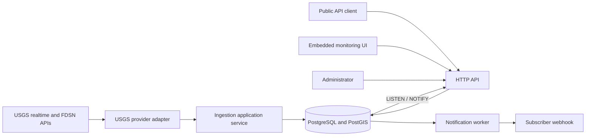
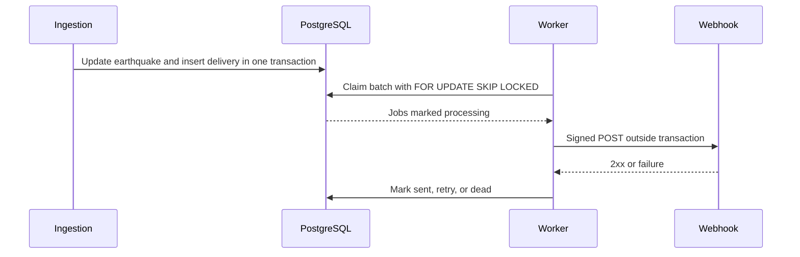

# Architecture

## Components

The executable is one modular monolith with `api`, `worker`, `all`, and `backfill` commands. Domain packages contain normalized models and trigger rules. Provider, HTTP, and PostgreSQL packages are adapters and dependencies point inward.

The API binary embeds a React + MapLibre single-page app (built from `web/`; see [frontend-spa.md](frontend-spa.md)) and serves it with an SPA fallback so client-side routes resolve on refresh. PostgreSQL triggers publish compact change references after commit. A dedicated API connection listens for those references, reloads normalized earthquake data, and broadcasts it through a bounded WebSocket hub. Notification changes emit only a content-free public resynchronization hint; administrative details remain available exclusively through the authenticated API.

## Ingestion flow

The provider fetches and parses data outside a database transaction. Realtime responses use persisted ETag and Last-Modified validators. Features are parsed independently so one malformed feature does not discard a valid feed.

The service opens bounded transactions of at most 250 events. Each event is identified by `(provider, external_id)`. A locked source record is checked by source timestamp and canonical payload hash. Stale responses cannot overwrite newer data; identical data updates only last-seen timestamps; material updates increment the canonical version and append a revision. Subscription matching and delivery inserts occur in the same transaction as the earthquake update.

The first successful realtime poll is a baseline. Its transaction completes before the baseline flag is stored, and it creates no notifications. Backfill and recovery use the same idempotent writes but never evaluate notifications.

## Notification flow

The unique delivery key makes job creation duplicate-safe. A lock timeout allows another worker to recover abandoned processing jobs. HTTP delivery validates DNS on every attempt, pins dialing to a validated address, disables redirects, and bounds time and response bytes.

## Database responsibilities

PostgreSQL stores canonical earthquakes, provider records and raw payloads, revisions, ingestion runs, provider cache/checkpoint state, subscriptions, and deliveries. PostGIS performs radius and bounding-box filtering. PostgreSQL row locks coordinate concurrent ingestion and notification workers.

## Failure recovery and scaling

Provider checkpoints and validators survive process restarts. An outage longer than 24 hours initiates an overlapping historical recovery before normal polling. Backfill checkpoints after each completed window.

API replicas are stateless except for their process-local rate limiter. Worker replicas coordinate with uniqueness constraints, row locks, and `SKIP LOCKED`. Webhook delivery remains at least once because a process can fail after the remote endpoint accepts a request but before the database records success.

Each API replica holds a PostgreSQL listener and its own WebSocket clients. PostgreSQL `NOTIFY` fan-out reaches every listening replica. WebSocket messages are best effort; bounded client buffers prevent slow browsers from applying backpressure, and reconnecting clients reload current state through the public HTTP API.
